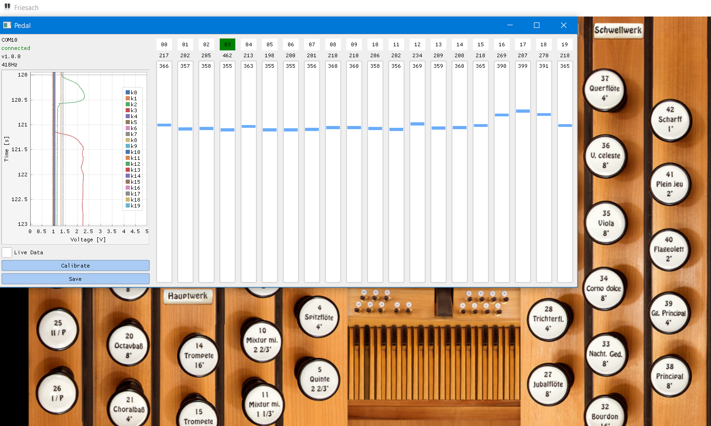

# Organ Midi Pedal
Organ midi pedal build from scratch with hall sensors for a very young men.

For reading the hall sensors, an arduio nano was installed as a microcontroller.
The driver, a small program written in Python, forwards the data to Grand Orgue
with the help of loopMidi. The user interface was
build with ImGui and ImPlot.

