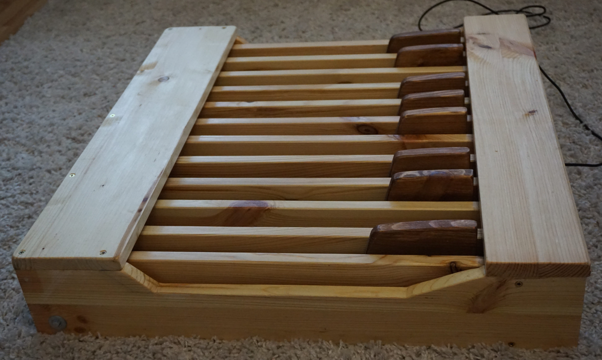
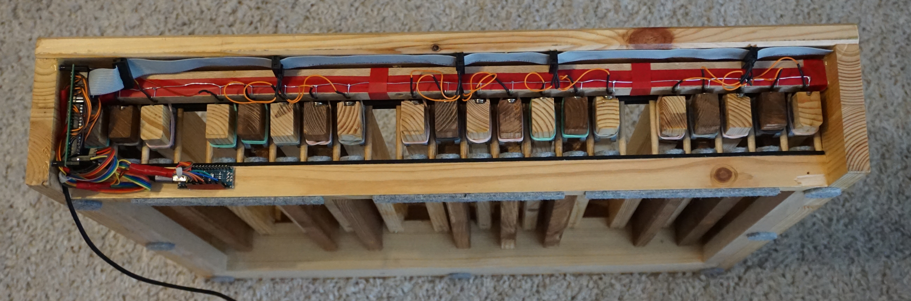
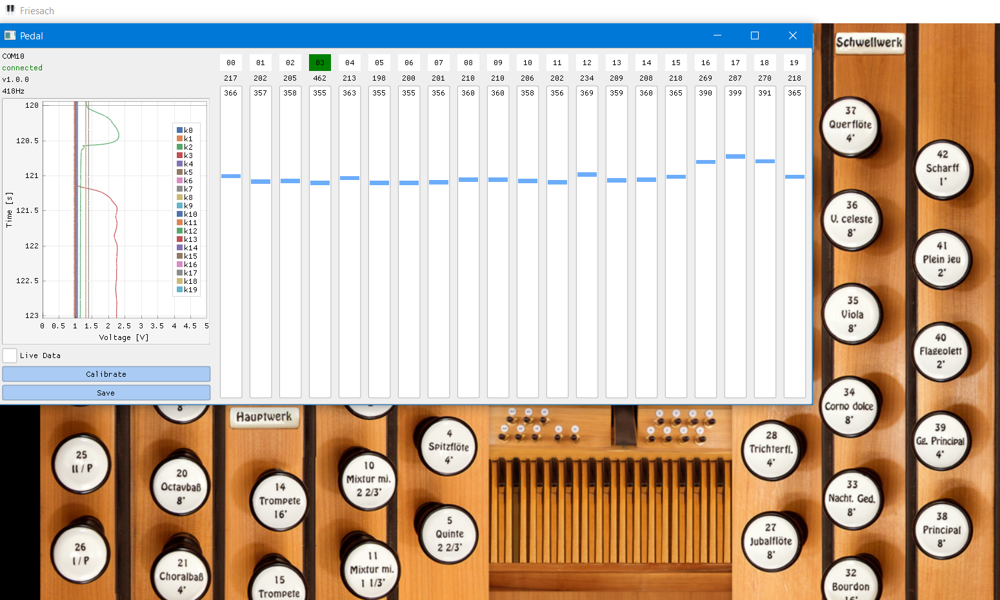

# Organ Midi Pedal
Organ Midi Pedal built from scratch. Using an Arduino Nano, a driver program written in Python forwards the data to Grand Orgue through LoopMidi. It is intentional that there're only 20 keys. Adaption to 30-32 keys for other projects may be possible with a reasonable effort.

